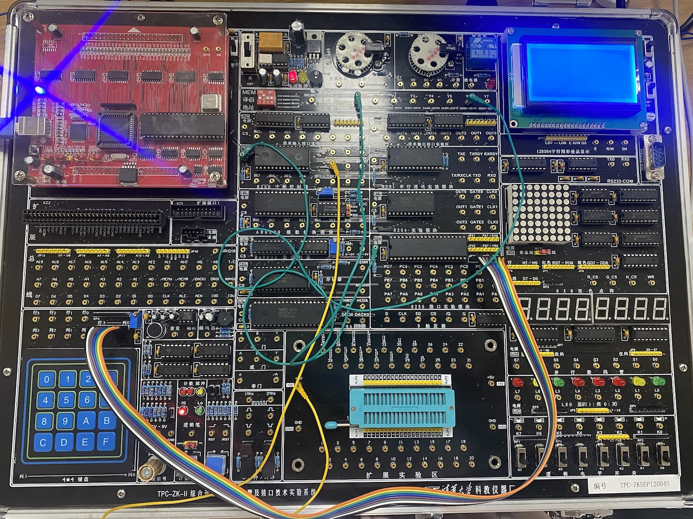

# MusiPlayer (x86 + Interface)

This repository contains x86 assembly code for multiple interface experiments, each corresponding to a specific folder. 

Images showcase the hardware connections for the respective experiments.

The final implementation, a music player (`Player.asm`), utilizes hardware timers to control the duration of each note and outputs the notes based on their frequencies. Additionally, we implemented song selection and interrupt-driven song switching functionalities using hardware buttons on the keyboard.
- **Player.asm**

The rainbow line links keyboard keys to calculate corresponding numbers based on keyboard coordinates, incorporating debounce. The yellow line combines music frequency with extended time, while the green line serves as an interrupt for song switching.
  
## Basic Experiments

#### **8254 Timer**

  
- **Left-side image**: The green line is the chip select signal (CS) for the 8254 chip, selecting counting channel 0. The blue line is the output of the counter linked to L0 (connected to the oscilloscope). The pink line is the gate control signal, set to a high level. The yellow signal is the CLK signal for counting channel 0, generated by manually toggling a button.
- **Right-side image**: The yellow line is the chip select signal (CS) for the 8254 chip in this experiment, selecting counting channel 2. The red line represents the counter output connected to the oscilloscope. The gate control signal for counting channel 2 is set to a high level, and CLK2 is linked to a 1MHz frequency signal.

#### **8255_LED**
 
- The color line represents the chip select signal for the 8255 chip and is connected to the CS (Chip Select) pin of the 8255 chip.
- The green line, referred to as the rainbow line (capable of connecting 8 port signals simultaneously), signifies the connection of the 8255 chip's PC port to toggle switch K0~K7, serving as input signals.
- The pink line, also a rainbow line, indicates the connection of the 8255 chip's PB port to the LED lights L0~L7, serving as output signals.

#### **8259_Interrupt**
 
- **Left-side image**: The interrupt signal is provided by manually input pulses. The left input pulse is connected to the master chip's interrupt IRQ3, and the right input pulse is connected to the slave chip's interrupt IRQ10. The 8255 chip is used to control the LED lights, with the initial state being L0-L4 lit and L5-L7 unlit. Each time an interrupt signal is received, the lighting pattern is reversed. Simultaneously, the interrupt service routine displays the currently executed interrupt on the computer screen. The program ends after 10 interrupts. 
- **Right-side image**: The signal is generated by PC6 and received by IRQ3 (yellow line). The program controls the PC6 port to output a clock signal for 5 cycles, and with the help of the 8255 chip and a delay program, it emulates the transition between high and low levels.

#### **AD_DA**
 
- **Left-side image(AD)**: The AD conversion system involves a chip select signal (pink line) for the 0809 chip. A manually adjusted DC signal (yellow line), ranging from 0 to 5V, serves as input to the 0809 chip's IN0 port. The AD conversion output, connected to interrupt IRQ3 (orange line), is processed by the interrupt service routine to display the 8-bit digital result as a 2-digit hexadecimal number (00H~FFH) on the screen.
- **Right-side image(DA)**: Connect the chip select signal of the 0832 chip and output Ua or Ub to the oscilloscope.

